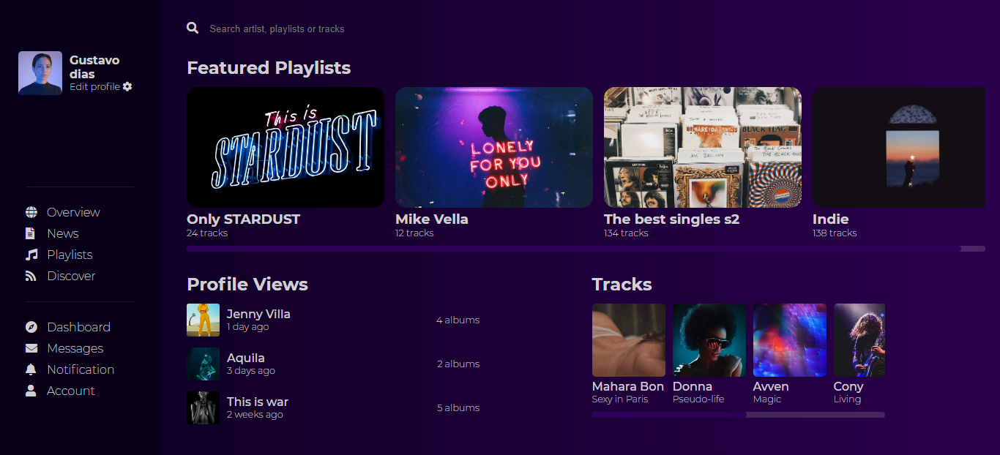

<br />
<p align="center">
 
   

  <h1 align="center">Music Library Page</h1>

</p>

## Descrição
Este foi o desafio de criar a página de biblioteca de músicas <a href="https://github.com/devchallenge-io/music-library-page">Music Library Page</a> (template), desenvolvendo o mais parecido possível com o <a href="./design/desktop.png">design de exemplo</a>.
___

## Demo
Acesse a <a href="https://gustavodias7.github.io/music-library-page/">demonstração</a> do site.
___

## Techs
- HTML
- CSS
___

## Download
```bash
$ git clone https://github.com/GustavoDias7/music-library-page.git
$ cd music-library-page
$ start index.html
```
___

## Meus Contatos
- <a href="https://www.linkedin.com/in/gustavo-dias-3100211b6/">Linkedin</a>
- <a href="https://www.instagram.com/gugadias__/">Instagram</a>
___

## Devchallenge 
<a href="https://devchallenge.now.sh/">DevChallenge</a> permite que você evolua suas skills como programador!<br>

## Créditos
Desafio criado por <a href="https://www.linkedin.com/in/emmanuel-messias-535621127/">Emmanuel Messias</a>.